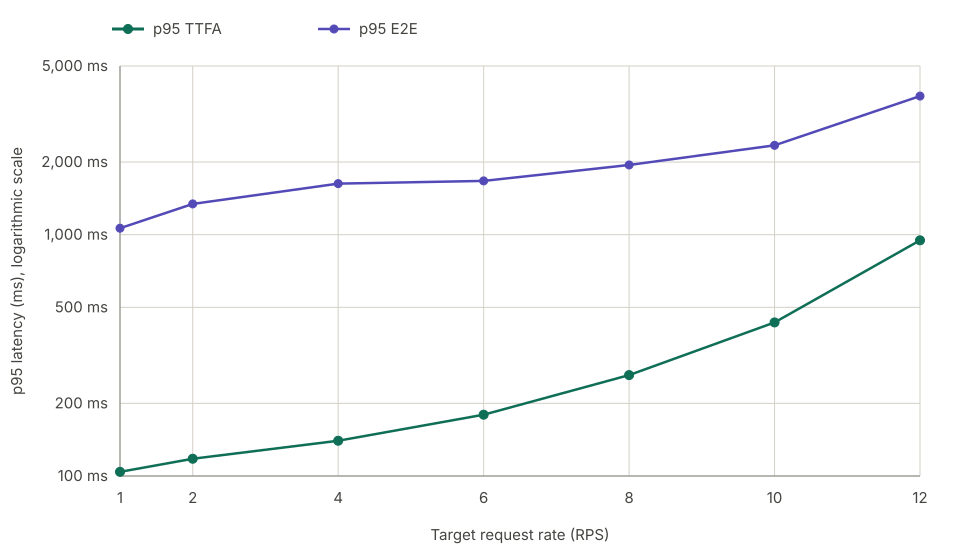

# M* Qwen3-TTS benchmark results

## Summary

M* returned complete, audible PCM for all 38,471 measurement requests across
21 promoted trials. All scheduled requests started, no arrivals were dropped,
and every promoted profile kept playback underruns below the promotion limit
of five requests/events. Every trial also had 20 ms leading-silence p95.

At RPS 1, 2, 4, 6, 8, 10, and 12, median p95 TTFA was 104.035 ms,
117.904 ms, 139.997 ms, 179.501 ms, 261.926 ms, 432.867 ms, and
947.566 ms, respectively. At the same rates, median p95 E2E was 1,063.777 ms,
1,341.255 ms, 1,627.710 ms, 1,670.380 ms, 1,944.817 ms, 2,345.637 ms, and
3,752.988 ms.

The series stops at RPS 12. RPS 16 was not promoted because tested profiles
either produced playback underruns or required large startup buffers and could not
satisfy continuity and sustainability together. RPS 20 was therefore not attempted.

For this benchmark, we implemented and applied custom source patches that expose
codec_chunk_frames as an init-time YAML override and add the initial code_chunk_ramp.
These features are not part of the referenced upstream revision. The results therefore
describe this pinned, custom-patched runtime; without the patches, the runtime retains
the default two-frame behavior and does not apply a ramp.

## Results

Headline values are medians across the three trials.

| RPS | Actual RPS | Profile | Underrun req. | p95 TTFA | p95 E2E | Peak in-flight |
| ---: | ---: | --- | ---: | ---: | ---: | ---: |
| 1 | 1.0267 | `f02-fixed-a0` | 0 | 104.035 ms | 1,063.777 ms | 7 |
| 2 | 1.9967 | `f02-fixed-a0` | 0 | 117.904 ms | 1,341.255 ms | 10 |
| 4 | 3.9100 | `f02-fixed-a0` | 0 | 139.997 ms | 1,627.710 ms | 15 |
| 6 | 5.9333 | `f09-r3-3-6-9-a0` | 0 | 179.501 ms | 1,670.380 ms | 19 |
| 8 | 7.9400 | `f09-r6-6-9-a0` | 0 | 261.926 ms | 1,944.817 ms | 26 |
| 10 | 9.9733 | `f11-fixed-a0` | 0 | 432.867 ms | 2,345.637 ms | 36 |
| 12 | 11.9300 | `f16-fixed-a0` | 0 | 947.566 ms | 3,752.988 ms | 56 |

Every row aggregates three fresh-start trials with complete audible PCM, zero
dropped arrivals, and stable runtime identity. `Peak
in-flight` is the maximum client-observed number of requests that had started
but had not yet completed.

## Latency by request rate



## Configuration

Profiles were applied through the M* YAML file passed to `mstar serve` with
`--config`. In the profile labels, `fNN` is the steady
`model_kwargs.codec_chunk_frames` value, `fixed` means no startup ramp, and
`rN-N-...` encodes the initial `model_kwargs.code_chunk_ramp` sequence. `a0`
means `max_concurrent_requests` was omitted and admission remained unlimited.

| Profile | Selected RPS | Steady frames | Startup ramp | Admission cap |
| --- | --- | ---: | --- | --- |
| `f02-fixed-a0` | 1, 2, 4 | 2 | None | Unlimited |
| `f09-r3-3-6-9-a0` | 6 | 9 | `[3, 3, 6, 9]` | Unlimited |
| `f09-r6-6-9-a0` | 8 | 9 | `[6, 6, 9]` | Unlimited |
| `f11-fixed-a0` | 10 | 11 | None | Unlimited |
| `f16-fixed-a0` | 12 | 16 | None | Unlimited |

For example, the selected RPS 12 YAML configuration was:

```yaml
model: qwen3_tts
max_seq_len: 32768
model_kwargs:
  codec_chunk_frames: 16
kv_cache:
  flashinfer_backend: fa2
node_groups:
  - node_names: [Talker]
    ranks: [0]
    graph_walks: [talker_prefill, talker_decode]
  - node_names: [Codec]
    ranks: [0]
    graph_walks: [codec_chunk]
```

The serving command was:

```bash
mstar serve qwen3_tts \
  --gpus 0 \
  --config /config/qwen3tts.yaml \
  --host 127.0.0.1 \
  --port 8000 \
  --log-stats \
  --log-stats-file /output/request-stats.jsonl
```

Codec chunk frames control how many frames are buffered for each waveform
decode. Larger chunks add playback margin but also increase startup latency.
The ramps used at RPS 6 and 8 start with smaller chunks before reaching the
steady frame size, which reduced TTFA while keeping underruns below the gate.
RPS 8 uses `[6, 6, 9]` because the RPS 6 ramp `[3, 3, 6, 9]` recorded 6
underruns at that higher rate, while the larger startup chunks recorded none.

RPS 10 and 12 use fixed chunks because the tested ramps were less reliable.
At RPS 10, `[6, 6, 10]` and `[10, 10, 11]` recorded 7 and 6 underruns,
respectively, while fixed `f11` recorded none. At RPS 12, `[11, 11, 12]` and
`[15, 15, 16]` recorded 32 and 28 underruns, while fixed `f16` recorded 2.
No admission cap was needed for any promoted profile.

Despite our effort, there might be a configuration that slightly edges out
ours.

## Hardware and environment

```text
Cloud                 Google Cloud Compute Engine
Zone                  asia-east1-c
Machine type          a3-highgpu-1g

GPU                   1 × NVIDIA H100 SXM 80GB HBM3
Architecture          NVIDIA Hopper
GPU memory            81,559 MiB reported by the driver
GPU part number       2330-885-A1
Board part number     692-2G520-0200-000
VBIOS                 96.00.A5.00.01
Power limit           700 W
Maximum clocks        1,980 MHz graphics/SM; 2,619 MHz memory

CPU                   Intel Xeon Platinum 8481C @ 2.70 GHz
vCPU                  26 (13 cores, 2 threads/core, 1 socket)
NUMA nodes            1
System memory         230 GiB
Storage               512 GiB persistent disk + 2 × 375 GiB local NVMe SSD

Operating system      Ubuntu 24.04.4 LTS
Kernel                6.17.0-1022-gcp
NVIDIA driver         580.173.02
CUDA compatibility    13.0 reported by nvidia-smi
CUDA toolkit          12.9
Python                3.12.3
Service manager       systemd 255
Runtime launch        Native M* process managed by systemd

Network path          Benchmark client and server on the same VM
Serving endpoint      localhost (127.0.0.1)
```

The benchmark client and serving runtime ran on the same machine over
localhost. Reported latency excludes production network, load-balancer, and
cross-zone effects.

## Measurement contract

- Model: `Qwen/Qwen3-TTS-12Hz-1.7B-CustomVoice` at revision
  `0c0e3051f131929182e2c023b9537f8b1c68adfe`, BF16, Ryan, English,
  PCM16 mono 24 kHz.
- Public upstream base:
  [`ea5e5a4b9c11d0493a1ba3986e07c1bafa1460a5`](https://github.com/mstar-project/mstar/commit/ea5e5a4b9c11d0493a1ba3986e07c1bafa1460a5).
- Dataset: 1,088 English Seed-TTS prompts; projection SHA-256
  `c95cb482f71117cbc46ac4e3aa5eab5c199bb0386d9e5600d912e157da8d2866`.
- Traffic: localhost open-loop Poisson arrivals, seeds 0/1/2, 30-second
  load-shaped warm-up, 300-second measurement, 120-second request timeout,
  and max in-flight 4,096.
- Text path: complete prompt sent once to `/v1/audio/speech` with
  `non_streaming_mode=false`.
- Lifecycle: fresh native service process, real PCM readiness smoke, stable
  idle VRAM, and pre/post service, listener, and GPU-process validation for
  every trial.
- Selection: all three seeds under one profile had to satisfy 100% complete
  audible PCM, zero underrun requests/events, no drops or request
  failures, stable runtime identity, at least 90% terminal-cohort completion,
  and full transport drain within 120 seconds.

## Benchmark command

Each trial used the following client command. `<RPS>` and `<SEED>` were
replaced by the trial values. Dataset and output placeholders represent
host-local paths; each run used the hashes recorded above and a new,
append-only output directory. The Deepgram credential was supplied through
the environment and is not stored in this report.

```bash
DEEPGRAM_API_KEY=<configured-in-environment> \
uv run bench run \
  --target mstar \
  --base-url http://127.0.0.1:8000 \
  --model Qwen/Qwen3-TTS-12Hz-1.7B-CustomVoice \
  --voice Ryan \
  --language English \
  --dataset <dataset-path> \
  --rps <RPS> \
  --warmup 30s \
  --duration 300s \
  --arrival poisson \
  --seed <SEED> \
  --timeout 120s \
  --max-in-flight 4096 \
  --output <unique-output-path> \
  --wer
```

See the repository [methodology](../../../docs/tts_bench/methodology.md) for
metric definitions and the complete artifact contract.
