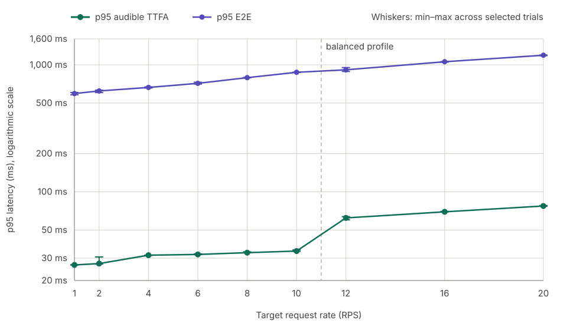

# Nari Qwen3-TTS benchmark results

## Summary

Nari Qwen3-TTS returned complete, audible raw PCM for all selected measurement
requests from target RPS 1 through 20. All scheduled requests started, no
arrivals were dropped, and no promoted request recorded a playback underrun.

Across three independent seeds, median p95 TTFA rose from 26.523 ms at RPS 1
to 77.231 ms at RPS 20. Median p95 E2E rose from 593.608 ms to 1,189.710 ms.

## Results

Headline latency and actual-RPS values are medians across the selected
fresh-start trials. Min–max latency ranges are shown by the figure whiskers.

| RPS | Actual RPS | Profile | Underrun req. | p95 TTFA | p95 E2E | Leading silence p95 | Peak in-flight |
| ---: | ---: | --- | ---: | ---: | ---: | ---: | ---: |
| 1 | 1.0267 | `ttfa` | 0 | 26.523 ms | 593.608 ms | 10 ms | 5 |
| 2 | 1.9967 | `ttfa` | 0 | 27.186 ms | 622.524 ms | 10 ms | 7 |
| 4 | 3.9100 | `ttfa` | 0 | 31.647 ms | 663.297 ms | 10 ms | 11 |
| 6 | 5.9333 | `ttfa` | 0 | 32.086 ms | 714.629 ms | 10 ms | 13 |
| 8 | 7.9400 | `ttfa` | 0 | 33.136 ms | 792.258 ms | 10 ms | 15 |
| 10 | 9.9733 | `ttfa` | 0 | 34.114 ms | 872.928 ms | 10 ms | 19 |
| 12 | 11.9556 | `balanced` | 0 | 62.235 ms | 913.072 ms | 10 ms | 23 |
| 16 | 16.0333 | `balanced` | 0 | 69.515 ms | 1,057.205 ms | 10 ms | 28 |
| 20 | 20.0567 | `balanced` | 0 | 77.231 ms | 1,189.710 ms | 10 ms | 36 |

Every row has 100% complete, nonempty, frame-aligned, audible PCM; zero dropped
arrivals; and stable container, process, listener, and
image identity. `Peak in-flight` is the maximum client-observed number of
started requests that had not yet completed.

## Latency by request rate



Whiskers show the min–max range across each selected trial set. The profile
boundary marks the change from `ttfa` to `balanced` between RPS 10 and 12.

## Configuration

Candidate variation within each source series was limited to
`QWEN3_TTS_PROFILE`.

| Profile | Selected RPS | Scheduling policy | Codec chunk schedule | Stage max batch |
| --- | --- | --- | --- | ---: |
| `ttfa` | 1–10 | `deadline_aware`, 1.0 s lead | `[1, 2, 4, 8, 12]` | 32 |
| `balanced` | 12–20 | `round_robin` | `[4, 4, 8, 16, 25]` | 64 |

The `balanced` profile was used from RPS 12 onward. It passed all nine
trials with all responses producing audible PCM and zero underruns.

## Hardware and environment

```text
Cloud                 Google Cloud Compute Engine
Zone                  asia-east1-c
Machine type          a3-highgpu-1g

GPU                   1 × NVIDIA H100 SXM 80GB HBM3
Architecture          NVIDIA Hopper
GPU memory            81,559 MiB reported by the driver
GPU device ID         0x233010DE
VBIOS                 96.00.A5.00.01
Power limit           700 W
Maximum clocks        1,980 MHz graphics/SM; 2,619 MHz memory

CPU                   Intel Xeon Platinum 8481C @ 2.70 GHz
vCPU                  26
System memory         230 GiB
Storage               512 GiB persistent disk + 2 × 375 GiB local NVMe SSD

Operating system      Ubuntu 24.04
Kernel                6.17.0-1021-gcp
NVIDIA driver         580.173.02
CUDA compatibility    13.0 reported by nvidia-smi
Container runtime     Docker Engine 29.1.3
Runtime launch        Fresh Docker container per scout and canonical trial

Network path          Benchmark client and server on the same VM
Serving endpoint      localhost (127.0.0.1)
```

The benchmark client and serving runtime ran on the same machine over
localhost. Reported latency excludes production network, load-balancer, and
cross-zone effects.

## Measurement contract

- Model: `Qwen/Qwen3-TTS-12Hz-1.7B-CustomVoice` at revision
  `0c0e3051f131929182e2c023b9537f8b1c68adfe`, Ryan, English, raw PCM16 mono
  24 kHz.
- Dataset: 1,088 English Seed-TTS prompts; projection SHA-256
  `c95cb482f71117cbc46ac4e3aa5eab5c199bb0386d9e5600d912e157da8d2866`.
- Traffic: localhost open-loop Poisson arrivals, 30-second load-shaped
  warm-up, 120-second request timeout, and max in-flight 4,096.
- Request: `target=nari`, `response_format=pcm`, `stream=true`, and
  `non_streaming_mode=false`.
- Lifecycle: fresh `docker run`, real raw-PCM readiness smoke, stable idle
  VRAM, and pre/post container, process, listener, restart, and log validation
  for every trial.
- Hard gate: all scheduled requests started; 100% complete, nonempty,
  frame-aligned, audible PCM; zero underrun requests/events; zero drops, HTTP
  errors, timeouts, 429s, OOMs, restarts, PID changes, or fatal runtime errors.
- Record-only fields: leading silence, WER score, and coverage.

## Runtime launch

Each trial used a fresh container. `<PROFILE>` was the only candidate-dependent
serving value within a source series.

```bash
docker run -d \
  --name nari-qwen3-tts-benchmark \
  --gpus all \
  -p 127.0.0.1:8000:8000 \
  -e QWEN3_TTS_LOCAL_FILES_ONLY=1 \
  -e QWEN3_TTS_PROFILE=<PROFILE> \
  -v <huggingface-cache>:/home/nari/.cache/huggingface:ro \
  -v <flashinfer-cache>:/home/nari/.cache/flashinfer \
  -v <torchinductor-cache>:/home/nari/.cache/torchinductor \
  -v <triton-cache>:/home/nari/.cache/triton \
  <RUNTIME_IMAGE>
```

Persistent compiler caches were reused, while the server process, scheduler,
CUDA graph state, and request state were recreated for every trial.

## Benchmark command

Each selected trial used the following client shape. `<RPS>`, `<SEED>`,
`<DURATION>`, and path placeholders were replaced per trial. `<WER_FLAG>`
was `--wer` where enabled.

```bash
DEEPGRAM_API_KEY=<configured-in-environment> \
uv run bench run \
  --target nari \
  --base-url http://127.0.0.1:8000 \
  --model Qwen/Qwen3-TTS-12Hz-1.7B-CustomVoice \
  --voice Ryan \
  --language English \
  --dataset <dataset-path> \
  --rps <RPS> \
  --warmup 30s \
  --duration <DURATION> \
  --arrival poisson \
  --seed <SEED> \
  --timeout 120s \
  --max-in-flight 4096 \
  --output <unique-output-path> \
  <WER_FLAG>
```

See the repository [methodology](../../../docs/tts_bench/methodology.md) for
metric definitions and the complete artifact contract.
