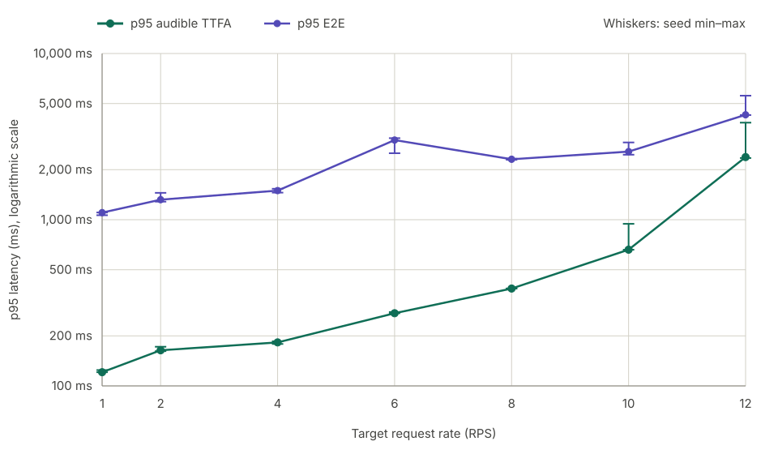

# SGLang-Omni Qwen3-TTS benchmark results

## Summary

SGLang-Omni's Qwen3-TTS support is still under active development. These
results reflect the current upstream support boundary and the pinned runtime
described below.

The tuned SGLang-Omni deployment completed all **36,089/36,089** measurement
requests across the seven reported rates. Every scheduled request was
dispatched, returned complete audible PCM, and drained without a request or
runtime failure, OOM, retraction, or CUDA Graph failure. Dynamic speech-onset trimming
kept leading-silence p95 at 0 ms.

Median p95 audible TTFA was **120.879 ms at RPS 1**, **163.808 ms at RPS 2**,
and **182.707 ms at RPS 4**. It rose to **273.700 ms at RPS 6**, **385.353 ms
at RPS 8**, **660.200 ms at RPS 10**, and **2,381.681 ms at RPS 12**. RPS 12
sustained the requested load; its three seed p95 values ranged from 2,350.814
to 3,836.556 ms. The series stops at RPS 12 because configuration-only tuning
could not achieve low TTFA while maintaining zero underruns at that load.

These measurements use a pinned Qwen3-TTS CustomVoice compatibility baseline:
an override that preserves the requested incremental streaming path and a
shared dynamic speech-onset trim. Candidate performance differences were
configuration-only.

## Results

Headline latency values are medians of the three per-seed p95 values.

| Target RPS | Actual RPS | Chunk i/f/s | Talker max | Initial wait/cap | Follow-up wait/cap | p95 TTFA | p95 E2E | Peak in-flight |
| ---: | ---: | ---: | ---: | ---: | ---: | ---: | ---: | ---: |
| 1 | 1.027 | `3/6/12` | 32 | `2ms/32` | `0ms/8` | **120.879 ms** | 1,103.228 ms | 7 |
| 2 | 1.997 | `4/3/12` | 32 | `2ms/32` | `0ms/8` | **163.808 ms** | 1,319.956 ms | 12 |
| 4 | 3.910 | `4/4/12` | 32 | `2ms/32` | `1ms/8` | **182.707 ms** | 1,496.872 ms | 16 |
| 6 | 5.933 | `6/6/12` | 32 | `2ms/32` | `0ms/8` | **273.700 ms** | 3,014.220 ms | 39 |
| 8 | 7.943 | `9/12/24` | 32 | `2ms/32` | `1ms/8` | **385.353 ms** | 2,310.934 ms | 34 |
| 10 | 9.973 | `12/15/32` | 24 | `2ms/32` | `1ms/8` | **660.200 ms** | 2,569.040 ms | 42 |
| 12 | 11.930 | `32/24/48` | 36 | `2ms/32` | `1ms/4` | **2,381.681 ms** | 4,278.388 ms | 79 |

## Latency by request rate



## Configuration

All rates use FlashInfer prefill and decode attention with KV page size 1,
`mem_fraction_static: 0.30`, radix caching disabled, Talker CUDA Graphs and
Torch compilation enabled, and Vocoder initial CUDA Graphs disabled. The
per-rate changes are:

| RPS | Talker CUDA Graph catalog | Chunk i/f/s | Initial | Follow-up |
| ---: | --- | ---: | ---: | ---: |
| 1 | B1/2/4/8/12/16/24/32 | `3/6/12` | `2ms/32` | `0ms/8` |
| 2 | B1/2/4/8/12/16/24/32 | `4/3/12` | `2ms/32` | `0ms/8` |
| 4 | B1/2/4/8/12/16/24/32 | `4/4/12` | `2ms/32` | `1ms/8` |
| 6 | B1–21 + B24/B32 | `6/6/12` | `2ms/32` | `0ms/8` |
| 8 | B1–21 + B24/B32 | `9/12/24` | `2ms/32` | `1ms/8` |
| 10 | B1–24 | `12/15/32` | `2ms/32` | `1ms/8` |
| 12 | B1–30 + B32/B36 | `32/24/48` | `2ms/32` | `1ms/4` |

RPS 1–8 use Talker max/compile/capture batch 32. RPS 10 uses 24. RPS 12
uses 36 and a 32-key sparse Code Predictor catalog: logical B31 pads to B32,
and B33–B36 pad to B36.

### Why these profiles were selected

The attention backend, KV page size, memory fraction, radix-cache setting,
Talker graph/compile enablement, and initial Vocoder wait/cap were held fixed.
Tuning focused on the settings that showed measurable effects in traces:
Talker capacity and graph coverage, chunk boundaries, and follow-up batching.

At RPS 1–2, follow-up work remained effectively single-job, so adding a 1 ms
batching wait did not help; the selected chunks instead preserve the smallest
playback margin that remained reliable in longer runs. At RPS 4 and 8, enough
compatible follow-up work accumulated for a 1 ms wait to form B2+ batches and
reduce scheduler calls and queue tails. RPS 4 also needed an earlier first
follow-up, while RPS 8 retained one extra initial frame after the smaller
boundary showed rare misses.

At RPS 10, limiting Talker execution to 24 with dense B1–24 graphs reduced long
Talker occupancy, while 1 ms follow-up batching reduced singleton Vocoder
queueing. At RPS 12, the RPS 10 profile no longer provided enough Talker
capacity or playback margin. The selected profile therefore uses Talker max
36, a 32-key sparse graph catalog, follow-up cap 4, and larger `32/24/48`
chunks. Those larger chunks reduce eager Vocoder call pressure and improve
continuity, but increase TTFA.

For example, the RPS 10 profile is:

```yaml
config_cls: Qwen3TTSPipelineConfig
runtime_overrides:
  tts_engine:
    server_args_overrides:
      prefill_attention_backend: flashinfer
      decode_attention_backend: flashinfer
      page_size: 1
      mem_fraction_static: 0.30
      max_running_requests: 24
      max_queued_requests: 128
      cuda_graph_max_bs: 24
      cuda_graph_bs: [1, 2, 3, 4, 5, 6, 7, 8, 9, 10, 11, 12,
                      13, 14, 15, 16, 17, 18, 19, 20, 21, 22, 23, 24]
      torch_compile_max_bs: 24
      disable_radix_cache: true
  vocoder:
    initial_chunk_frames: 12
    stream_initial_followup_stride: 15
    stream_followup_stride: 32
    stream_stride: 32
    stream_left_context_frames: 16
    initial_batch_wait_ms: 2
    initial_max_batch_size: 32
    followup_batch_wait_ms: 1
    followup_max_batch_size: 8
    initial_cuda_graph: false
```

## Current upstream support boundary

SGLang-Omni does not yet exercise every Qwen3-TTS optimization surface in this
runtime. In particular, the upstream v0.1.2 documentation states that
[CustomVoice and VoiceDesign remain non-streaming](https://github.com/sgl-project/sglang-omni/blob/v0.1.2/docs/cookbook/qwen3_tts.md#L186-L197),
while this benchmark requires a fixed compatibility override to reach the
incremental path; the pinned Vocoder path also does not use its initial CUDA
Graph option. As upstream streaming and CUDA Graph coverage matures, later
SGLang-Omni releases may improve substantially beyond these results.

Despite our effort, there might be a configuration that slightly edges out
ours.

## Hardware and environment

```text
Cloud                 Google Cloud Compute Engine
Zone                  asia-east1-c
Machine type          a3-highgpu-1g

GPU                   1 × NVIDIA H100 SXM 80GB HBM3
GPU memory            81,559 MiB reported by the driver
VBIOS                 96.00.A5.00.01
NVIDIA driver         580.173.02
Persistence mode      enabled

Host OS               Ubuntu 22.04.5 LTS
Kernel                6.8.0-1064-gcp or 6.8.0-1065-gcp
Container runtime     Docker
Torch                 2.11.0+cu130
CUDA reported by Torch 13.0
Transformers          5.12.1
qwen-tts              0.1.1

Network path          Benchmark client and server on the same VM
Serving endpoint      localhost (127.0.0.1)
```

The benchmark client and serving runtime ran on the same machine over
localhost. Reported latency excludes production network, load-balancer, and
cross-zone effects.

## Measurement contract

- Model: `Qwen/Qwen3-TTS-12Hz-1.7B-CustomVoice` at revision
  `0c0e3051f131929182e2c023b9537f8b1c68adfe`, BF16, Ryan, English,
  PCM16 mono 24 kHz.
- SGLang-Omni revision:
  [`2cac60e8ac38cf5d3c7091ec3dd15782bc8b1f41`](https://github.com/sgl-project/sglang-omni/commit/2cac60e8ac38cf5d3c7091ec3dd15782bc8b1f41).
- SGLang revision:
  [`fdebc938f7f4d16fe6b9f55dcd9a767cf0899ea1`](https://github.com/sgl-project/sglang/commit/fdebc938f7f4d16fe6b9f55dcd9a767cf0899ea1).
- Benchmark revision: `328bd5b0132f06ae76dc36d122da7ab84ed64198`.
- Dataset: 1,088 English Seed-TTS prompts; projection SHA-256
  `c95cb482f71117cbc46ac4e3aa5eab5c199bb0386d9e5600d912e157da8d2866`.
- Traffic: localhost open-loop Poisson arrivals, seeds 0/1/2, one continuous
  30-second load-shaped warm-up plus 300-second measurement, 120-second request
  timeout, and max in-flight 4,096.
- Warm-up: tokenizer/Vocoder readiness followed by deterministic/log-driven
  Code Predictor CUDA Graph capture and coordinator/GPU idle barriers.
- Validity: 100% complete audible PCM, no drops or request failures, no
  measurement-time graph capture, and no OOM/retraction/runtime error.
- Semantic evaluation: WER was disabled in these performance runs and remains
  to be scored from the retained PCM.

## Benchmark command

Each seed used a fresh server and one uninterrupted benchmark invocation:

```bash
uv run bench run \
  --target sglang-omni \
  --base-url http://127.0.0.1:8000 \
  --model Qwen/Qwen3-TTS-12Hz-1.7B-CustomVoice \
  --voice Ryan \
  --language English \
  --dataset <dataset-path> \
  --rps <RPS> \
  --warmup 30s \
  --duration 300s \
  --arrival poisson \
  --seed <SEED> \
  --timeout 120s \
  --max-in-flight 4096 \
  --output <unique-output-path>
```

See the repository [methodology](../../../docs/tts_bench/methodology.md) for
metric definitions and the complete artifact contract.
