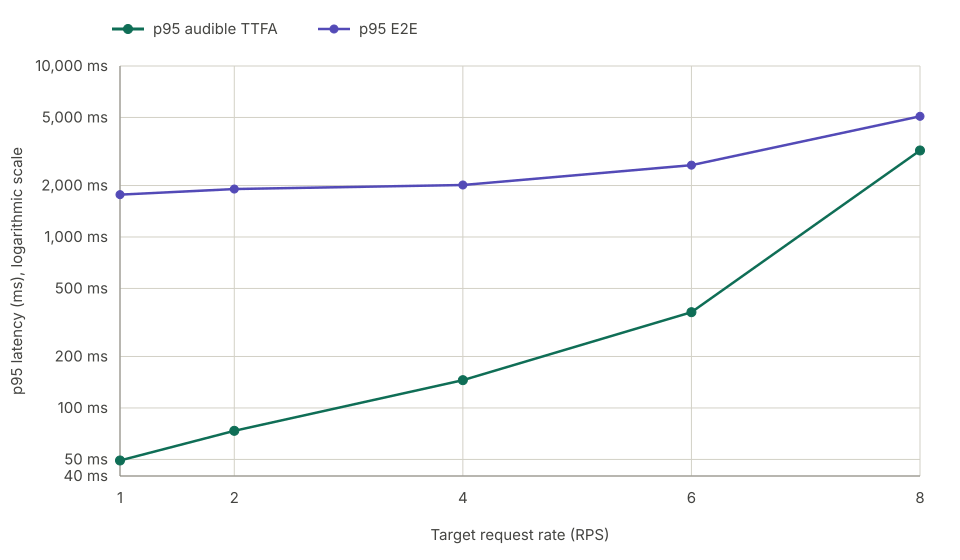

# VoxServe Qwen3-TTS benchmark results

## Summary

VoxServe returned complete, audible PCM for all 18,699 promoted measurement
requests from target RPS 1 through 8. All scheduled requests started, no
arrivals were dropped, and no promoted request recorded a playback underrun.
Every promoted trial also had 0 ms leading-silence p95 with dynamic onset
trimming enabled.

At RPS 1, 2, 4, 6, and 8, p95 TTFA was 49.3 ms, 73.5 ms, 145.4 ms,
363.2 ms, and 3,205.9 ms, respectively. At the same rates, p95 E2E was
1,768.7 ms, 1,907.2 ms, 2,013.8 ms, 2,630.7 ms, and 5,078.6 ms.

The series stops at RPS 8. RPS 9 had zero underruns but was not sustainable:
completion reached 8.067 RPS against 8.300 offered RPS, with 72 requests still
in flight when the measurement window ended, so it failed the promotion gate.

For this benchmark, we added a minimal custom `--detokenize-ramp` source patch
to test variable startup detokenization intervals. Non-steady ramp chunks used
the eager detokenizer path, while the steady interval reused the existing CUDA
graph. Every ramp profile tested at RPS 4, 6, and 8 produced playback underruns,
and one RPS 8 ramp also exhausted GPU memory. No ramp profile was promoted, so
the final profiles varied only the fixed `--detokenize-interval`. The custom
option is not part of the referenced upstream revision; omitting it preserves
the original fixed-interval behavior.

## Results

Headline values are the reported p95 values for the selected profile at each
promoted request rate.
The profile column encodes maximum batch size (`b`), detokenization interval
(`d`), and maximum page configuration (`p`).

| RPS | Actual RPS | Profile | Underrun | p95 TTFA | p95 E2E | Peak |
| ---: | ---: | --- | ---: | ---: | ---: | ---: |
| 1 | 0.9300 | `b8-d1-pdefault` | 0 | 49.3 ms | 1,768.7 ms | 6 |
| 2 | 2.0433 | `b8-d2-pdefault` | 0 | 73.5 ms | 1,907.2 ms | 10 |
| 4 | 3.9200 | `b16-d4-pdefault` | 0 | 145.4 ms | 2,013.8 ms | 16 |
| 6 | 5.9733 | `b16-d7-pdefault` | 0 | 363.2 ms | 2,630.7 ms | 26 |
| 8 | 7.9900 | `b16-d9-p1536` | 0 | 3,205.9 ms | 5,078.6 ms | 52 |

Every promoted trial also had complete audible PCM, zero dropped arrivals, and
stable service, listener, and scheduler identity. `Peak` is the highest
client-observed number of requests that had started but had not yet completed.

## Latency by request rate



## Configuration

Profile names encode `b` as maximum batch size, `d` as detokenization interval,
and `p` as the KV-cache page configuration. `pdefault` uses VoxServe's default
2,048 pages, while `p1536` explicitly caps the cache at 1,536 pages. For
example, `b16-d7-pdefault` uses batch size 16, decodes accumulated audio codec
tokens every 7 tokens, and uses 2,048 KV-cache pages. The runtime source
remained pinned throughout the profile search.

The selected profile components map to flags as follows:

| Profile component | VoxServe flag | Selected values |
| --- | --- | --- |
| `bN` | `--max-batch-size N` | Maximum requests/chunks per inference cycle; RPS 1/2 used `8`, while RPS 4/6/8 used `16` |
| `dN` | `--detokenize-interval N` | Audio codec tokens accumulated per waveform decode; RPS 1/2/4/6/8 used `1/2/4/7/9` |
| `pdefault` | Default `--max-num-pages 2048` | Used for RPS 1/2/4/6 |
| `p1536` | `--max-num-pages 1536` | Used for RPS 8 |
| not selected | Custom `--detokenize-ramp` | Tested at RPS 4/6/8; every candidate recorded playback underruns |
| fixed | `--scheduler-type base` | Used for every promoted profile |
| fixed | `--unroll-depth-cuda-graph` | Enabled for every profile |

For example, the selected RPS 6 profile expanded to:

```bash
vox-serve \
  --model Qwen/Qwen3-TTS-12Hz-1.7B-CustomVoice \
  --host 127.0.0.1 \
  --port 8000 \
  --scheduler-type base \
  --unroll-depth-cuda-graph \
  --max-batch-size 16 \
  --detokenize-interval 7
```

Batch size 8 reduced VRAM use at RPS 1 and 2; RPS 4, 6, and 8 used batch size
16 for greater concurrent capacity. A smaller detokenization interval can
reduce first-chunk latency but invokes the audio decoder more often, so the
selected interval increased with load. The custom ramp attempted to start with
smaller eager-decoded chunks before switching to the steady CUDA-graph interval,
but every tested ramp recorded underruns. The promoted profiles therefore used
only fixed intervals.

RPS 1 through 6 used the default 2,048 KV-cache pages. For the RPS 8 candidate,
the batch-16, interval-9 configuration failed during startup with the default
2,048 pages: it ran out of GPU memory while capturing the batch-size-1 detokenization
CUDA graph, before the benchmark workload began. Setting `--max-num-pages 1536` reduced
the fixed KV-cache allocation by 7 GiB and allowed the profile to start and run reliably.
The stable `base` scheduler and unrolled depth CUDA graphs were retained for every
promoted profile.

Despite our effort, there might be a configuration that slightly edges out
ours.

## Hardware and environment

```text
Cloud                 Google Cloud Compute Engine
Zone                  asia-east1-c
Machine type          a3-highgpu-1g

GPU                   1 × NVIDIA H100 SXM 80GB HBM3
Architecture          NVIDIA Hopper
GPU memory            81,559 MiB reported by the driver
GPU part number       2330-885-A1
Board part number     965-2G520-6300-001
VBIOS                 96.00.A5.00.01
Power limit           700 W
Maximum clocks        1,980 MHz graphics/SM; 2,619 MHz memory

CPU                   Intel Xeon Platinum 8481C @ 2.70 GHz
vCPU                  26 (13 cores, 2 threads/core, 1 socket)
NUMA nodes            1
System memory         230 GiB
Storage               512 GiB persistent disk + 2 × 375 GiB local NVMe SSD

Operating system      Ubuntu 24.04.4 LTS
Kernel                6.17.0-1022-gcp
NVIDIA driver         580.173.02
CUDA compatibility    13.0 reported by nvidia-smi
CUDA toolkit          12.9
Python                3.12.3
Service manager       systemd 255
Runtime launch        Native VoxServe process managed by systemd

Network path          Benchmark client and server on the same VM
Serving endpoint      localhost (127.0.0.1)
```

The benchmark client and serving runtime ran on the same machine over
localhost. Reported latency excludes production network, load-balancer, and
cross-zone effects.

## Measurement contract

- Model: `Qwen/Qwen3-TTS-12Hz-1.7B-CustomVoice` at revision
  `0c0e3051f131929182e2c023b9537f8b1c68adfe`, BF16, Ryan, English,
  PCM16 mono 24 kHz.
- Public upstream base:
  [`ce212de19e5df651ad9a44e5e3719b5e8cdb8ee3`](https://github.com/vox-serve/vox-serve/commit/ce212de19e5df651ad9a44e5e3719b5e8cdb8ee3).
- Dataset: 1,088 English Seed-TTS prompts; projection SHA-256
  `c95cb482f71117cbc46ac4e3aa5eab5c199bb0386d9e5600d912e157da8d2866`.
- Traffic: localhost open-loop Poisson arrivals, seeds 0/1/2, 30-second
  warm-up, 300-second measurement, 120-second timeout, and max in-flight
  4,096.
- Text path: complete prompt sent once to `/v1/audio/speech` with
  `non_streaming_mode=false`; the server used its `base` scheduler.
- Lifecycle: fresh systemd service and scheduler process, real PCM readiness
  smoke, stable idle VRAM, and pre/post process-identity validation for every
  trial.
- Selection: all three seeds under one profile had to satisfy 100% complete
  audible PCM, 0 ms leading-silence p95, zero underrun requests/events, no
  drops or request failures, sustainable completion without a growing backlog,
  and stable runtime identity.

## Benchmark command

Each trial used the following client command. `<RPS>` and `<SEED>` were
replaced by the trial values. Dataset and output placeholders represent
host-local paths; each run used the hash recorded above and a new, append-only
output directory. The Deepgram credential was supplied through the environment
and is not stored in this report.

```bash
DEEPGRAM_API_KEY=<configured-in-environment> \
uv run bench run \
  --target voxserve \
  --base-url http://127.0.0.1:8000 \
  --model Qwen/Qwen3-TTS-12Hz-1.7B-CustomVoice \
  --voice Ryan \
  --language English \
  --dataset <dataset-path> \
  --rps <RPS> \
  --warmup 30s \
  --duration 300s \
  --arrival poisson \
  --seed <SEED> \
  --timeout 120s \
  --max-in-flight 4096 \
  --output <unique-output-path> \
  --wer
```

See the repository [methodology](../../../docs/tts_bench/methodology.md) for
metric definitions and the complete artifact contract.
