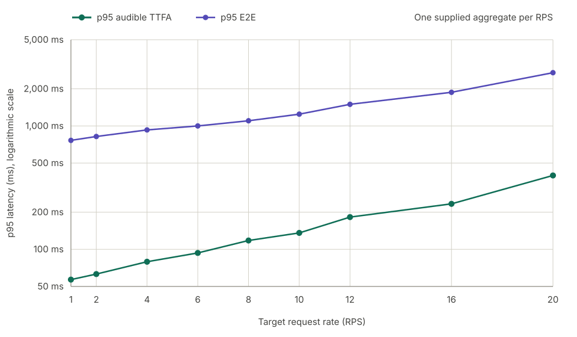

# vLLM-Omni Qwen3-TTS benchmark results

## Summary

Across the supplied aggregates, p95 TTFA rose from 56.815 ms at RPS 1 to
396.900 ms at RPS 20. p95 E2E rose from 764.178 ms to 2,701.688 ms.

The runtime used a dynamic PCM-onset trim override. These results describe that
pinned trim-patched runtime, not an unmodified vLLM-Omni build.

## Results

| RPS | Actual RPS | Profile | p95 TTFA | p95 E2E | Peak in-flight |
| ---: | ---: | --- | ---: | ---: | ---: |
| 1 | 1.0733 | `ramp22435` | 56.815 ms | 764.178 ms | 5 |
| 2 | 1.9633 | `ramp2432` | 63.002 ms | 821.222 ms | 6 |
| 4 | 3.9100 | `ramp331632-r4` | 79.316 ms | 928.587 ms | 12 |
| 6 | 5.8533 | `ramp331632-r6` | 93.451 ms | 1,000.197 ms | 16 |
| 8 | 7.8933 | `ramp441632` | 117.900 ms | 1,101.593 ms | 16 |
| 10 | 9.9433 | `ramp441632` | 135.839 ms | 1,245.829 ms | 21 |
| 12 | 11.9300 | `ramp551632` | 182.469 ms | 1,497.415 ms | 29 |
| 16 | 16.0333 | `ramp551632` | 233.677 ms | 1,874.268 ms | 43 |
| 20 | 20.0567 | `ramp771632` | 396.900 ms | 2,701.688 ms | 62 |

`Peak in-flight` is the maximum client-observed number of requests that had
started but had not yet completed.

## Latency by request rate



The figure contains all nine supplied target request rates. Each point is the
p95 value from its supplied aggregate; no cross-trial whiskers are shown.

## Configuration

We first established a common serving baseline using settings that had already
shown consistently good behavior, then held that baseline fixed across every
reported RPS. We also kept output-quality settings unchanged and avoided
varying settings that had shown no meaningful effect on serving performance.
This kept the comparison focused on performance without trading away audio
quality or introducing noise from low-impact configuration changes.

The fixed baseline included:

- Pipeline: async chunking and shared-memory codec streaming enabled with a
  72-frame codec left context.
- Stage 0 (talker): `performance_mode: interactivity`, 64 maximum sequences,
  async scheduling, prefix caching disabled, and 512 maximum batched tokens.
- Stage 1 (Code2Wav): 64 maximum sequences, `enforce_eager: false`, async
  scheduling, prefix caching disabled, and 65,536 maximum batched tokens.
- Both stages used trusted remote code and the same sampling parameters across
  all request rates.

With that baseline in place, per-RPS tuning focused on the codec-streaming
settings that measurably affected latency and throughput:
`codec_chunk_frames`, `codec_chunk_ramp`,
`decode_cudagraph_capture_sizes`, and
`decode_cudagraph_extra_capture_shapes`.

### Runtime profile values

The profile is a vLLM-Omni YAML file passed through `vllm serve
--deploy-config`. The blocks below show only the codec values selected for the
reported RPS; the remaining serving settings were held constant.

```yaml
# RPS 1 — ramp22435
codec_chunk_frames: 35
codec_left_context_frames: 72
codec_chunk_ramp: [2, 2, 4, 35]
decode_cudagraph_capture_sizes: [2, 4, 8, 43, 61, 78, 107]
decode_cudagraph_extra_capture_shapes: [[2, 2], [2, 4], [2, 8], [2, 43]]

# RPS 2 — ramp2432
codec_chunk_frames: 32
codec_left_context_frames: 72
codec_chunk_ramp: [2, 4, 32]
decode_cudagraph_capture_sizes: [2, 6, 14, 22, 30, 38, 46, 54, 62, 70, 78, 86, 94, 102, 104]
decode_cudagraph_extra_capture_shapes: [[2, 2], [2, 6], [2, 38]]

# RPS 4 — ramp331632-r4
codec_chunk_frames: 32
codec_left_context_frames: 72
codec_chunk_ramp: [3, 3, 16, 32]
decode_cudagraph_capture_sizes: [3, 6, 14, 22, 30, 38, 46, 54, 62, 70, 78, 86, 94, 102, 104]
decode_cudagraph_extra_capture_shapes: [[2, 3], [2, 6], [2, 22], [2, 54], [2, 86]]

# RPS 6 — ramp331632-r6
codec_chunk_frames: 32
codec_left_context_frames: 72
codec_chunk_ramp: [3, 3, 16, 32]
decode_cudagraph_capture_sizes: [3, 6, 14, 22, 30, 38, 46, 54, 62, 70, 78, 86, 94, 102, 104]
decode_cudagraph_extra_capture_shapes: [[2, 3], [2, 6], [2, 14], [2, 46]]

# RPS 8, 10 — ramp441632
codec_chunk_frames: 32
codec_left_context_frames: 72
codec_chunk_ramp: [4, 4, 16, 32]
decode_cudagraph_capture_sizes: [4, 8, 16, 24, 32, 40, 48, 56, 64, 72, 80, 88, 96, 104]
decode_cudagraph_extra_capture_shapes: [[2, 4], [2, 8], [2, 24], [2, 48], [2, 56]]

# RPS 12, 16 — ramp551632
codec_chunk_frames: 32
codec_left_context_frames: 72
codec_chunk_ramp: [5, 5, 16, 32]
decode_cudagraph_capture_sizes: [5, 10, 18, 26, 34, 42, 50, 58, 66, 74, 82, 90, 98, 104]
decode_cudagraph_extra_capture_shapes: [[2, 5], [2, 10], [2, 26], [2, 58], [2, 66], [2, 74], [2, 90], [2, 104], [3, 5], [3, 10], [3, 26], [3, 58], [3, 90], [3, 104], [4, 58]]

# RPS 20 — ramp771632
codec_chunk_frames: 32
codec_left_context_frames: 72
codec_chunk_ramp: [7, 7, 16, 32]
decode_cudagraph_capture_sizes: [7, 14, 22, 30, 38, 46, 54, 62, 70, 78, 86, 94, 102, 104]
decode_cudagraph_extra_capture_shapes: [[2, 7], [2, 14], [2, 30], [2, 38], [2, 46], [2, 54], [2, 62], [2, 70], [2, 78], [2, 86], [2, 94], [2, 104], [3, 7], [3, 14], [3, 30], [3, 62], [3, 94], [3, 104], [4, 7], [4, 14], [4, 30], [4, 62], [5, 7], [5, 14], [5, 30], [6, 7], [6, 14], [6, 30]]
```

All configs set `decode_cudagraph_batch_sizes: [1]` and enabled async chunking
and shared-memory codec streaming. They also shared the same stage settings: 64
maximum sequences per stage, 0.3 GPU memory utilization per stage, async
scheduling, and maximum batched-token limits of 512 for the talker and 65,536
for Code2Wav.

Despite our effort, there might be a configuration that slightly edges out
ours.

The serving command was:

```bash
vllm serve /models/Qwen3-TTS-12Hz-1.7B-CustomVoice \
  --served-model-name Qwen/Qwen3-TTS-12Hz-1.7B-CustomVoice \
  --deploy-config /deploy/qwen3_tts.yaml \
  --omni \
  --host 127.0.0.1 \
  --port 8000 \
  --trust-remote-code
```

## Hardware and environment

```text
Cloud                 Google Cloud Compute Engine
Zone                  asia-east1-c
Machine type          a3-highgpu-1g

GPU                   1 × NVIDIA H100 SXM 80GB HBM3
Architecture          NVIDIA Hopper
GPU memory            81,559 MiB reported by the driver
GPU part number       2330-885-A1
Board part number     692-2G520-0200-000
VBIOS                 96.00.A5.00.01
Power limit           700 W
Maximum clocks        1,980 MHz graphics/SM; 2,619 MHz memory

CPU                   Intel Xeon Platinum 8481C @ 2.70 GHz
vCPU                  26 (13 cores, 2 threads/core, 1 socket)
NUMA nodes            1
System memory         230 GiB
Storage               512 GiB persistent disk + 2 × 375 GiB local NVMe SSD

Operating system      Ubuntu 24.04.4 LTS
Kernel                6.17.0-1022-gcp
NVIDIA driver         580.173.02
CUDA compatibility    13.0 reported by nvidia-smi
CUDA toolkit          12.9
Python                3.12.3
Container runtime     Docker Engine 29.7.2
Runtime launch        vLLM-Omni in a fresh Docker container per trial

Network path          Benchmark client and server on the same VM
Serving endpoint      localhost (127.0.0.1)
```

The benchmark client and serving runtime ran on the same machine over
localhost. Reported latency excludes production network, load-balancer, and
cross-zone effects.

## Measurement contract

- Model: `Qwen/Qwen3-TTS-12Hz-1.7B-CustomVoice` at revision
  `0c0e3051f131929182e2c023b9537f8b1c68adfe`, BF16, Ryan, English,
  PCM16 mono 24 kHz.
- Public runtime revision:
  [`a4ea67a21b20054dacc6e83952f9bd407e8ee4e7`](https://github.com/vllm-project/vllm-omni/commit/a4ea67a21b20054dacc6e83952f9bd407e8ee4e7).
- Runtime image ID:
  `sha256:5cba1538c6f8ee81e8bea6708c24e68d7b2640f466a9fbf2ef15e68f2168b48b`.
- Dataset: 1,088 English Seed-TTS prompts; projection SHA-256
  `c95cb482f71117cbc46ac4e3aa5eab5c199bb0386d9e5600d912e157da8d2866`.
- Traffic: localhost open-loop Poisson arrivals, 30-second load-shaped warm-up,
  300-second measurement, 120-second request timeout, and max in-flight 4,096.
- Text path: complete prompt sent once to `/v1/audio/speech` with
  `non_streaming_mode=false`.
- Lifecycle: fresh container, real PCM readiness smoke, stable idle VRAM, and
  pre/post container, process, listener, and restart validation for every
  trial.
- Result sources: refreshed RPS 1/2/4/6/8/10/12/16/20 aggregates supplied on
  2026-08-19.
- WER and its coverage were recorded but were not selection gates.

## Benchmark command

Each trial used the following client command. `<RPS>` and `<SEED>` were
replaced by the trial values. Dataset and output placeholders represent
host-local paths; each run used the hash recorded above and a new append-only
output directory. The Deepgram credential was supplied through the environment
and is not stored in this report.

```bash
DEEPGRAM_API_KEY=<configured-in-environment> \
uv run bench run \
  --target vllm-omni \
  --base-url http://127.0.0.1:8000 \
  --model Qwen/Qwen3-TTS-12Hz-1.7B-CustomVoice \
  --voice Ryan \
  --language English \
  --dataset <dataset-path> \
  --rps <RPS> \
  --warmup 30s \
  --duration 300s \
  --arrival poisson \
  --seed <SEED> \
  --timeout 120s \
  --max-in-flight 4096 \
  --output <unique-output-path> \
  --wer
```

See the repository [methodology](../../../docs/tts_bench/methodology.md) for
metric definitions and the complete artifact contract.
